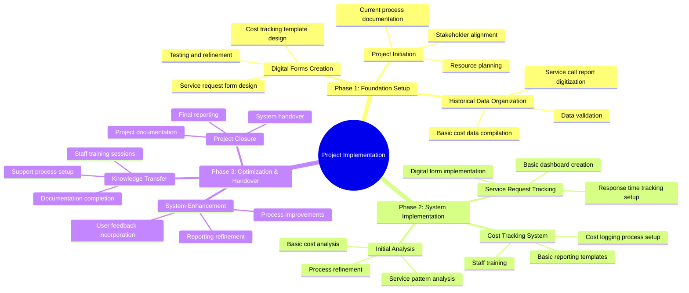
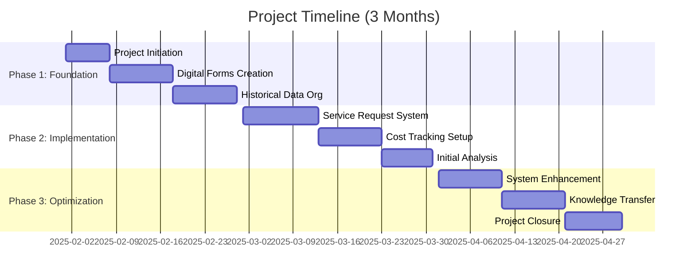

# Implementing Service Request Tracking and Cost Management System at an IT Service Provider

> A Proposal report for the BDM capstone Project

 

Submitted by

Name: Dabgar Milav Jayeshkumar

Roll number: 21F1005510

 

IITM Online BS Degree Program, 

Indian Institute of Technology, Madras, Chennai

Tamil Nadu, India, 600036

[TOC]

## Declaration Statement

I am working on a Project titled “Implementing Service Request Tracking and Cost Management System at an IT Service Provider”. I extend my appreciation to Vardhan Insys, for providing the necessary resources that enabled me to conduct my project.

I hereby assert that the data presented and assessed in this project report is genuine and precise to the utmost extent of my knowledge and capabilities. The data has been gathered from primary sources and carefully analyzed to assure its reliability. 

Additionally, I affirm that all procedures employed for the purpose of data collection and analysis have been duly explained in this report. The outcomes and inferences derived from the data are an accurate depiction of the findings acquired through thorough analytical procedures.

I am dedicated to adhering to the principles of academic honesty and integrity, and I am receptive to any additional examination or validation of the data contained in this project report.

I understand that the execution of this project is intended for individual completion and is not to be undertaken collectively. I thus affirm that I am not engaged in any form of collaboration with other individuals, and that all the work undertaken has been solely conducted by me. In the event that plagiarism is detected in the report at any stage of the project's completion, I am fully aware and prepared to accept disciplinary measures imposed by the relevant authority. 

I understand that all recommendations made in this project report are within the context of the academic project taken up towards course fulfillment in the BS Degree Program offered by IIT Madras. The institution does not endorse any of the claims or comments.

  

Name: Dabgar Milav Jayeshkumar

Date: January 30, 2025

## Executive Summary and Title

The project focuses on Vardhan Insys, an ISO 9001:2015 certified company located in Ahmedabad, Gujarat, that provides Annual Maintenance Contract (AMC) services for IT equipment to government polytechnic colleges. Currently managing over 10000 computers, 2500 printers, and 2000 CCTV cameras across 40+ institutions, the company handles approximately 350-400 service requests monthly through a WhatsApp/call-based system.

While the company maintains paper-based service call reports and basic financial records, they face significant challenges in tracking and analyzing service request patterns and associated costs. The current manual system makes it difficult to optimize response times, plan resource allocation, and understand the true costs of service delivery.

This project aims to address these challenges through two key initiatives. First, implementing a structured system for tracking and analyzing service requests to optimize response times and resource allocation. Second, establishing a basic but effective cost tracking mechanism to understand service delivery costs. The project will leverage existing service call reports as a foundation while introducing simple digital tracking systems.

By focusing on these fundamental aspects, the project seeks to establish a strong operational foundation that can be built upon in the future. The expected outcomes include improved service response times, better resource utilization, and clearer understanding of service costs, ultimately leading to enhanced operational efficiency and customer satisfaction.

## Organization Background

Vardhan Insys, established in 2015, is an ISO 9001:2015 certified IT services company based in Ahmedabad, Gujarat. The company has shown consistent growth, expanding from servicing 5 institutions in 2015 to currently managing AMC contracts for 40+ government polytechnic colleges across Gujarat. With a team of 13 skilled technicians and 5 senior technical supervisors, they handle approximately 350-400 service requests monthly.

The company's core expertise lies in managing and maintaining critical IT infrastructure components including computers (10000+ units), printers (2500+ units), CCTV systems (2000+ cameras), and CWAN equipment. Their service capacity has grown by 40% annually over the past three years, with a current response time averaging 24-48 hours for standard requests and 4-8 hours for emergencies.

Their client portfolio includes prestigious institutions like Physical Research Laboratory (PRL), Gujarat University, Gujarat Technological University, and numerous government polytechnic colleges. The company maintains a 92% client retention rate and has achieved a 15% year-over-year revenue growth in the last fiscal year.

## Problem Statement

### Service Request Analysis and Response Time Optimization

The company's current WhatsApp/call-based service system and paper-based service call reports prevent effective analysis of service patterns and optimization of response times. While basic service records exist, there is no systematic way to track, analyze, and improve service request handling, response times, and resource allocation. This affects the company's ability to optimize technician deployments, meet service level agreements, and improve customer satisfaction through faster resolution times.

### Basic Cost Tracking Implementation

The company lacks a structured system for tracking and analyzing the basic costs associated with service delivery. While overall AMC contract values and major expenses are recorded, there is no systematic tracking of routine costs such as parts replacement, technician time, and travel expenses. This prevents understanding of service delivery costs and impacts the company's ability to make informed decisions about resource allocation and pricing strategies.

## Background of the Problem

The challenges faced by Vardhan Insys have evolved alongside the company's rapid growth from a small IT service provider to a significant player in Gujarat's educational sector. Over the past eight years, as the company expanded from servicing 5 institutions to managing over 40+ government polytechnic colleges, its traditional operational methods have begun showing significant limitations.

 

Figure 1 Sample Service & Installation Call Report

Initially, when managing a handful of clients, the WhatsApp-based service request system and paper-based documentation were adequate for daily operations. However, as service volumes grew to 350-400 requests monthly, these manual systems became increasingly inefficient. The geographic spread of clients across Gujarat further complicated service delivery, making it difficult to optimize technician deployments and manage response times effectively.

  

Figure 2 Sample WhatsApp Based Service Request Ticketing

The industry's evolution has also played a crucial role in highlighting these operational gaps. Modern educational institutions now expect faster response times and digital tracking capabilities, putting pressure on traditional service providers to modernize their operations. Additionally, the competitive landscape has shifted, with larger providers offering sophisticated service tracking and management systems.

Cost management challenges have become particularly acute as the company's operations have scaled. While the basic financial tracking systems sufficed for smaller operations, they now struggle to capture and analyze the complex cost structures involved in serving multiple institutions with varying needs. This limitation affects not only operational efficiency but also strategic decision-making in areas like resource allocation and pricing strategies.

## Problem Solving Approach

### Methods Used with Justification

The project employs focused methodologies aligned with BDM course frameworks:

1. Service Request Analysis Methods:
   - Time series analysis of service patterns
   - Response time tracking and analysis
   - Resource utilization assessment Justification: These methods,      covered in Operations Management modules, enable data-driven service      optimization.
2. Cost Analysis Methods:
   - Basic cost categorization
   - Service delivery cost tracking
   - Simple cost allocation methods Justification: These      approaches, from Financial Management modules, provide foundational cost      understanding.

### Data Collection with Justification

1. Primary Data Collection:
   - Digitization of existing service call reports
   - Implementation of digital service request forms
   - Basic cost tracking templates Justification: Builds on      existing data sources while introducing simple digital tracking.
2. Supporting Data Collection:
   - Technician time and travel records
   - Parts replacement logs
   - Client feedback forms Justification: Provides context and      validation for primary data analysis.

### Analysis Tools with Justification

1. Basic Analysis Tools:
   - Excel for data organization and analysis
   - Google Forms for data collection
   - Simple visualization tools Justification: Easily implementable      tools that meet immediate needs.
2. Process Tools:
   - Service request tracking templates
   - Cost logging worksheets
   - Progress monitoring dashboards Justification: Essential for      systematic data capture and monitoring.

## Expected Timeline

### Work Breakdown Structure:

The project implementation is structured across three distinct phases, each building upon the previous to ensure systematic development and deployment of the new systems:

### Phase 1: Foundation Setup (February 2025)

This initial phase focuses on establishing the groundwork for the entire project. It begins with thorough documentation of current processes and stakeholder alignment to ensure all parties understand and support the planned changes. The phase includes designing digital forms to replace paper-based systems and organizing historical data for analysis. This foundation is crucial for ensuring smooth implementation of new systems while maintaining operational continuity.

### Phase 2: System Implementation (March 2025)

The second phase involves deploying the designed solutions and beginning data collection in the new format. This includes implementing the digital service request system, setting up cost tracking mechanisms, and initiating basic analysis of collected data. Training staff on new systems and processes is a key component of this phase, ensuring adoption and proper usage of new tools.

### Phase 3: Optimization & Handover (April 2025)

The final phase focuses on refining the implemented systems based on initial usage feedback and validating their effectiveness. It includes knowledge transfer to ensure sustainable operation of the new systems, documentation completion, and project closure activities. This phase is critical for ensuring the long-term sustainability of the improvements.

 

Figure 3 Mind Map of Work Breakdown Structure

### Gantt chart

Figure 4 Project Timeline Gantt Chart

## Expected Outcome

The implementation of this focused project will deliver several significant improvements to Vardhan Insys's operations across multiple areas:

The primary outcome will be an enhanced service request management system that transforms the current manual process into a streamlined digital workflow. Through the implementation of a digital service request tracking system, the company will gain clear visibility into response times and service patterns. This will enable more effective resource allocation and lay the groundwork for future service optimizations.

In terms of cost management, the project will establish foundational systems for tracking and understanding service delivery costs. By implementing basic cost tracking mechanisms and establishing clear cost categorization processes, the company will be better positioned to make informed decisions about resource allocation and pricing strategies. The standardized cost reporting templates and initial analysis capabilities will provide the framework needed for future cost optimization initiatives.

Operational efficiency will see substantial improvements through the reduction of manual data entry and enhanced service request visibility. The new systems will enable better resource planning and more informed decision-making capabilities. This systematic approach to service delivery will result in more organized and efficient operations across all service locations.

Perhaps most importantly, the project will develop the team's capabilities through comprehensive training on the new systems and documented processes. This knowledge enhancement will empower staff to utilize basic analysis capabilities and lay the foundation for future improvements. The documented procedures and enhanced operational knowledge will ensure sustainable long-term benefits from the implemented changes.

Through these improvements, Vardhan Insys will be better positioned to meet client expectations, optimize resource utilization, and maintain its competitive edge in the IT service sector.